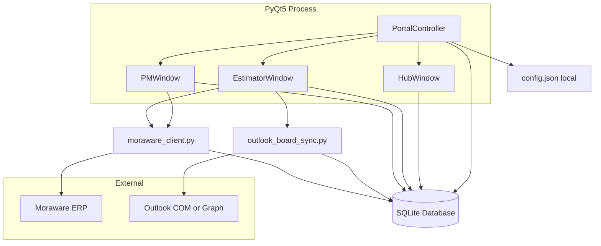

# Architecture (BidTracker runtime)

## Bottom line

One process hosts three portal windows sharing one `Database` (SQLite). Config is local JSON. Moraware and Outlook are optional external read integrations.

## Component diagram

## PortalController

File: `keystone_bid_tracker/main.py`

- Creates Hub / Estimator / PM windows with one shared `Database`.
- `_switch_to` hides other portals, preserves geometry/maximized state, persists `last_portal` via config.
- Startup restores last portal (`get_last_portal`).

## Estimator portal (typical tabs)

Wired in `ui/main_window.py` (Estimator window): Bids, Calendar (Bid Board), Customers/Accounts, Reports, Settings (also on Hub), import helpers as present.

## PM portal (wired tabs)

| Tab | Class | Source |
|---|---|---|
| Active Jobs | `PMActiveJobsTab` | Moraware `list_jobs(active_only=True)` + local link overlay; session cache on `PMWindow` |
| Pending Award | `PMPendingAwardTab` | Local: WON, no Moraware link |
| Completed History | `PMHistoryTab` | Local `invoice_data` rollups |

**Note:** `PMOverviewTab` (Pipeline Forecast) is implemented but **not tabbed** in `main_window.py`. `AwardedTab` is unwired; its helpers (`InvoiceSyncWorker`, `AwardedDetailPanel`, `PMEditJobDialog`) are reused.

## Data access

- All CRUD in `keystone_bid_tracker/database.py` (`Database` class).
- SQLite WAL, foreign keys on, busy timeout.
- Schema created + migrated in `init_db()` (CREATE TABLE + additive ALTER COLUMN list + indexes + backfills).

## Config

- `keystone_bid_tracker/config.py` reads/writes `config.json` (gitignored) beside the app.
- Holds DB path, Dropbox bids path, Moraware credentials, Outlook sync settings, estimator colors, last portal, etc.
- See [../03-integrations/config-and-secrets.md](../03-integrations/config-and-secrets.md).

## Integration boundaries (important for CounterPro)

| Integration | BidTracker approach (reference) | CounterPro direction |
|---|---|---|
| Moraware | Hybrid web login + scrape + XML API v5 in Python | **Reuse** CounterPro `backend/` + `tools/moraware-cli` + `azure-moraware-function`. Do **not** port Python client. |
| Outlook | Desktop COM (workaround) or Graph (intended) → board upsert | Server-side Graph / existing M365; COM not viable on Render |
| Storage | Dropbox-synced SQLite | Supabase Postgres via `database/migrations/` |

## Key source files

| Area | Path |
|---|---|
| Entry / portals | `keystone_bid_tracker/main.py`, `ui/main_window.py` |
| Schema / CRUD | `database.py` |
| Theme / status colors | `styles/theme.py` |
| Moraware | `utils/moraware_client.py` |
| Outlook | `utils/outlook_board_sync.py`, `outlook_provider.py`, `outlook_com_client.py`, `outlook_graph_client.py` |
