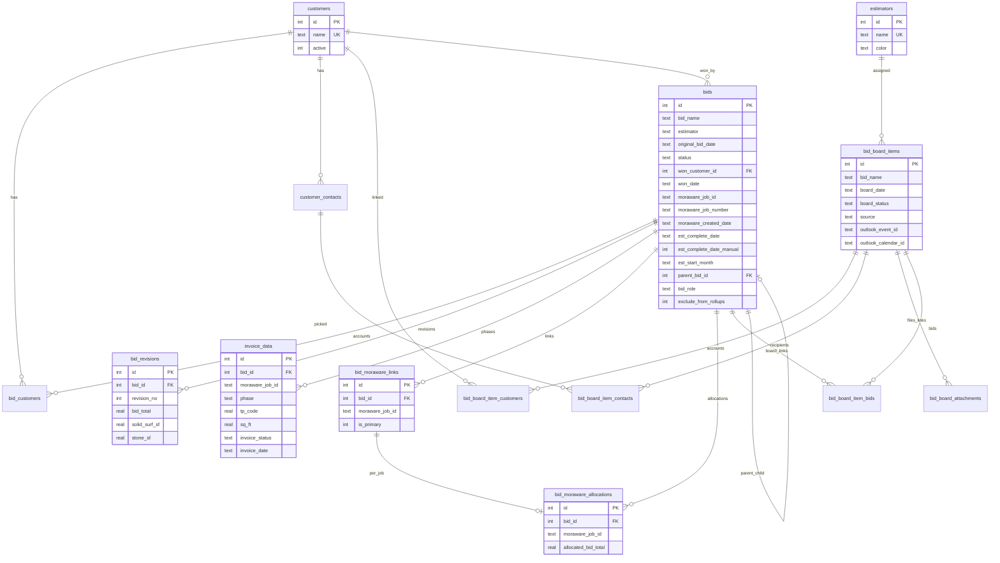

# ER diagram (BidTracker)

Mermaid ER for current SQLite schema. Source: `keystone_bid_tracker/database.py` / [schema.sql](schema.sql).

## Relationship notes

- **Financials** hang off `bid_revisions`, not `bids`.
- **Board authority** for linked bids is `bid_board_item_bids` (not legacy `created_bid_id`).
- **Moraware authority** for multi-link is `bid_moraware_links`; `bids.moraware_job_id` mirrors primary.
- **Allocations** FK to `(bid_id, moraware_job_id)` on links.
- Outlook uniqueness: unique index on `(outlook_calendar_id, outlook_event_id)` where event id is present.
