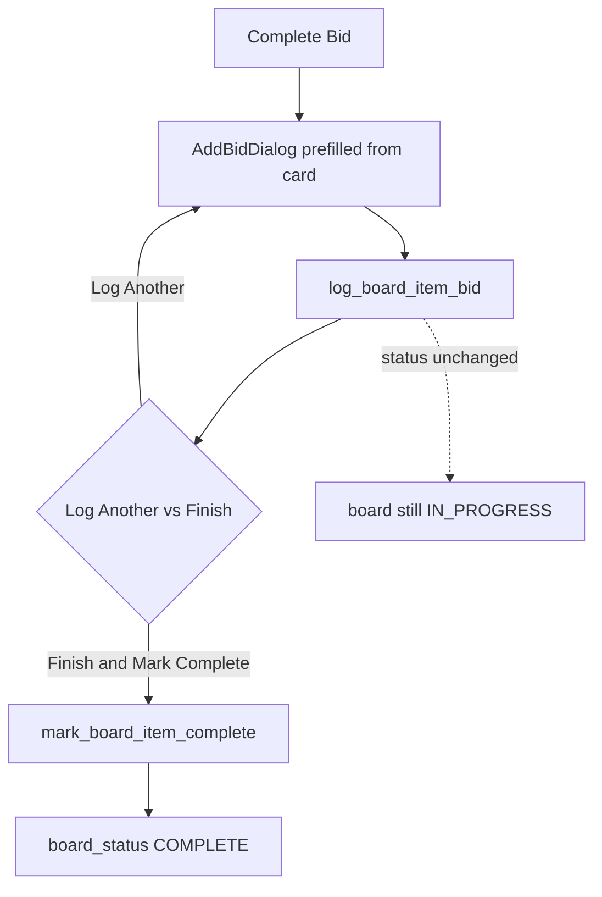

# Bid Board & calendar

**Bottom line:** A Bid Board item is an **estimating opportunity**, not a bid. One card can link **zero, one, or many** independent normal bids. Board status (`IN_PROGRESS` / `COMPLETE` / `NOT_BIDDING`) is orthogonal to bid status — **COMPLETE ≠ WON**. Logging a bid does not complete the card; only **Finish & Mark Complete** (or Mark Complete without a bid) does.

> **Framing:** WHAT / WHY is authoritative. PyQt calendar mechanics are reference. Outlook details live primarily in `03-integrations/`; this doc only covers board-facing rules.

---

## WHAT / WHY (business rules)

### Opportunity vs bid

| Concept | Table / link | Role |
|---|---|---|
| Board item | `bid_board_items` | Calendar opportunity (due/board date, estimator, accounts, notes) |
| Linked bids | `bid_board_item_bids` | Many-to-many: one opportunity → many **independent** bids (alternate pricing / materials / accounts) |
| Legacy FK | `created_bid_id` | Old single-bid pointer; **backfilled into** `bid_board_item_bids`; **not** authority |

Linked bids are **not revisions**. Each linked bid has its own revision history.

### Board statuses

| Status | Meaning |
|---|---|
| `IN_PROGRESS` | Default; work in flight |
| `COMPLETE` | Estimator finished the opportunity (may or may not have logged bids) |
| `NOT_BIDDING` | Explicitly declined / not pursuing |

Colors (UX convention BidTracker uses):

- `IN_PROGRESS` + unassigned → gray (`UNASSIGNED_GRAY`)
- `IN_PROGRESS` + assigned → estimator roster color
- `COMPLETE` → universal complete blue (any estimator)
- `NOT_BIDDING` → distinct brown (`NOT_BIDDING_COLOR`)

Gray is **derived**, never stored as a status.

### Complete Bid loop (critical)

1. **Log Bid** creates a normal bid via the same `_insert_bid_rows` path and inserts `bid_board_item_bids` — **does not** set `COMPLETE`.
2. After each successful log, the user chooses:
   - **Log Another Bid** → stay open / log again (still not COMPLETE unless already was).
   - **Finish & Mark Complete** → then mark the board item `COMPLETE` and set `completed_at`.
3. Therefore: multiple bids can attach to one card **before** completion; completion is an explicit second step.

### Other status paths

- **Mark Complete without bid** — board can go blue with zero linked bids.
- **NOT_BIDDING** — set without creating bids; reversible to `IN_PROGRESS` (clears `completed_at` when returning to progress).
- **Link Existing Bid** — attach an already-created bid to the card; does **not** change board status.
- **Unlink** — removes the join row only; **keeps the bid**; does **not** change board status.

### COMPLETE ≠ WON

- Completing a board item does **not** mark any bid `WON`.
- Winning a bid does **not** complete the board item.
- These lifecycles stay independent on purpose.

### Drag / date move

- Dragging a card on the calendar updates **`board_date` only** (`update_board_item_date`).
- It does not change status, estimator, or linked bids.

### Outlook-sourced items (board rules only)

- Items with `source='OUTLOOK'` are upserted from calendar sync (read-only import into local board).
- **Local `COMPLETE` is never undone by Outlook** (`resolve_outlook_status` keeps COMPLETE even if categories change).
- If the card already has linked bids, Outlook `NOT_BIDDING` does not force that status.
- COM desktop sync is a temporary workaround; Graph is the intended long-term path — see `03-integrations/` (and handoff README Outlook note). Do not plan CounterPro around desktop COM.

---

## HOW BidTracker does it (reference)

| Concern | Path |
|---|---|
| Calendar UI / drag / Complete loop | `ui/calendar_tab.py` |
| Create / edit card dialog | `ui/bid_board_item_dialog.py` |
| Link existing bid picker | `ui/link_board_bid_dialog.py` |
| Board CRUD / log / link / complete | `database.py` → `add_board_item`, `update_board_item`, `update_board_item_date`, `set_board_item_status`, `log_board_item_bid`, `link_existing_board_bid`, `unlink_board_item_bid`, `mark_board_item_complete`, `get_board_item_bids` |
| Outlook status resolve | `utils/outlook_board_sync.py` → `resolve_outlook_status` |
| Colors | `config.py` → `get_estimator_color`, `get_complete_blue`, `NOT_BIDDING_COLOR`, `UNASSIGNED_GRAY` |

### Complete Bid loop (reference)

---

## Invariants to preserve in CounterPro

1. Opportunity and bid are separate entities with a many-to-many join.
2. Logging a bid ≠ completing the opportunity.
3. Unlink never deletes the bid.
4. Board COMPLETE never implies bid WON (and vice versa).
5. Outlook (or any calendar sync) must not reopen a locally completed opportunity.
