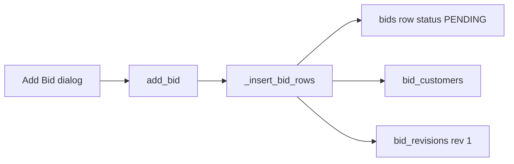

# Estimator bids & revisions

**Bottom line:** A bid is the durable commercial pricing record. Financials live on **revisions**; status lives on the bid. New bids start **PENDING**, may move to **BIDDING** or **WON**, and **WON** bids cannot be deleted. Parent (post-split) bids are excluded from normal lists.

> **Framing:** WHAT / WHY below is authoritative. HOW BidTracker implements this in PyQt is reference only — do not treat UI layout or class names as a porting spec. Cite paths under `keystone_bid_tracker/` when comparing behavior.

---

## WHAT / WHY (business rules)

### Bid identity

- A **bid** (`bids`) has name, estimator, original bid date, notes, optional due date / location, and **status**.
- Accounts are linked via `bid_customers` (many accounts per bid).
- **Money and SF are never authoritative on the bid row.** They live on `bid_revisions` (`bid_total`, `solid_surf_sf`, `stone_sf`, optional `reason`, `revision_date`).

### Creation invariant

- Creating a bid always creates:
  1. the `bids` row,
  2. zero or more `bid_customers` links,
  3. **revision 1** with the initial totals.
- Shared insert path ensures board “log bid” and normal “add bid” cannot diverge on this shape.

### Status lifecycle

| Status | Meaning |
|---|---|
| `PENDING` | Default for new bids; open / not actively bidding in Moraware sense |
| `BIDDING` | Estimator actively working / competing |
| `WON` | Awarded locally; requires a `won_customer_id`; sets won metadata |

- Legacy statuses `LOST` and `DEAD` are **migrated to `PENDING`** on database init (no longer selectable in UI).
- Marking **WON** sets at least `won_customer_id` and typically `won_date` (plus salesperson / PM / notes as entered).
- **WON bids are not deletable** — delete is blocked in UI and raises in the data layer.
- Moving a WON bid “back to bidding” (PM path) clears won/Moraware state and returns status to `PENDING` — that is a separate workflow (see linking/splits / Active Jobs docs), not a soft delete.

### Latest revision

- **Latest revision** = row with `MAX(revision_no)` for that bid.
- Lists, exports, allocations, and reports that need a single dollar/SF figure use the latest revision.
- Adding a revision appends `MAX(revision_no) + 1`; history is retained.

### Edit-totals rule

- Editing bid header fields (name, estimator, date, notes, accounts) always updates the bid row.
- **Totals on edit update revision 1 only when it is the sole revision** (`revision_no == 1` and it is still latest).
- Once a second revision exists, editing the bid does **not** rewrite historical revision totals — create a new revision instead.

### Parent / child exclusion

- After a Moraware multi-job **split**, the original bid becomes `bid_role='parent'` with `exclude_from_rollups=1`.
- **Parent bids are excluded from normal bid lists** (`COALESCE(bid_role,'normal') != 'parent'`). Children appear as normal WON bids.
- Rollups (PM stats, awarded views that honor the flag) also skip `exclude_from_rollups=1`.

---

## HOW BidTracker does it (reference)

| Concern | Path |
|---|---|
| Shared create | `database.py` → `_insert_bid_rows`, `add_bid` |
| List + parent filter | `database.py` → `get_bids` |
| Status / delete / revisions | `database.py` → `mark_bid_status`, `mark_bid_won`, `delete_bid`, `add_revision`, `update_revision`, `get_latest_revision` |
| LOST/DEAD → PENDING | `database.py` schema migration on open |
| Add / edit UI | `ui/add_bid_dialog.py`, `ui/bids_tab.py` (`_on_add_bid`, `_edit_bid`) |
| Detail + actions | `ui/bid_detail.py` |
| New revision | `ui/add_revision_dialog.py` |
| Mark Won | `ui/mark_won_dialog.py` → `mark_bid_won` |

### Create flow (reference)

### Edit totals (reference)

In `bids_tab.py` `_edit_bid`: after `update_bid`, if `get_latest_revision` has `revision_no == 1`, call `update_revision` with the dialog totals; otherwise leave revisions alone and optionally `mark_bid_status` if status changed.

---

## Invariants to preserve in CounterPro

1. Financials versioned; latest = max revision number.
2. WON requires a won account; WON not deletable.
3. Create always seeds revision 1 in the same transaction as the bid.
4. Split parents hidden from day-to-day bid lists / rollups.
5. Inactive accounts: pickers hide them, but already-linked accounts remain selectable when editing (see accounts-contacts).
