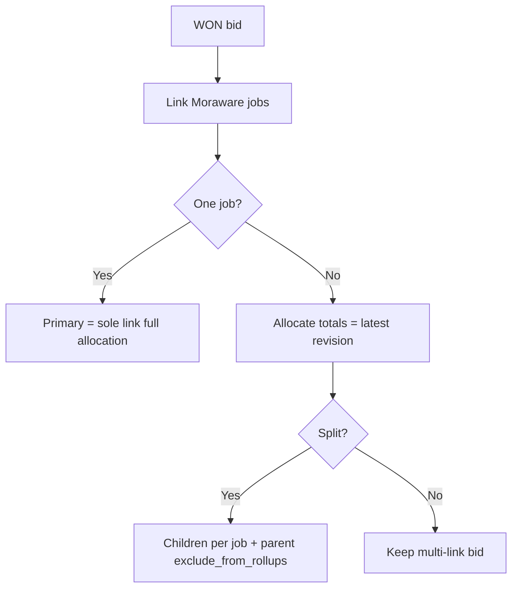

# PM linking, allocations & splits

**Bottom line:** A WON bid links to one or more Moraware jobs via `bid_moraware_links` (exactly one **primary** when linked). Legacy `bids.moraware_job_id` **mirrors the primary**. Multi-job quotes use **allocations** that must sum to the **latest revision**; **split** materializes one child bid per job and parks the parent out of rollups. **Unsync** clears Moraware data but keeps WON; **move back to bidding** clears award + Moraware entirely.

> **Framing:** WHAT / WHY is authoritative. Dialogs are reference. CounterPro must map onto its own Moraware caches — do not create a parallel ERP client.

---

## WHAT / WHY (business rules)

### Bid ↔ Moraware links

- Table: `bid_moraware_links` (`bid_id`, `moraware_job_id`, job number/name, `is_primary`).
- Unique on `(bid_id, moraware_job_id)`.
- When any links exist, **exactly one** is primary (`is_primary=1`).
- Setting primary copies `moraware_job_id` / `moraware_job_number` onto the `bids` row (legacy mirror for older queries/UI).
- Removing the last link clears the mirror columns.
- Adding a second link without allocations defaults new allocation rows to **0** (first/sole link can auto-allocate full latest-revision totals).

**Job id vs job number:** internal Moraware id and display job number are different fields — never infer one from the other.

### Allocations

- Table: `bid_moraware_allocations` — per linked job: `allocated_bid_total`, `allocated_solid_surf_sf`, `allocated_stone_sf`.
- **Target** = latest revision totals for the bid.
- Validation: sums must match expected within **±0.01** on each of dollars / solid SF / stone SF.
- Save rejects rows for jobs that are not linked.
- Invoice phase TP/SF by job can be shown as **reference**, not as the authoritative bid total.

### Split

Preconditions:

- Bid is `WON`
- Not already a `child`
- Not already split (no existing children)
- **≥ 2** linked Moraware jobs
- Allocations validate against latest revision

Effects:

1. Create one **child** WON bid per linked job (`bid_role='child'`, `parent_bid_id` set).
2. Child name prefers Moraware job name / number.
3. Child gets revision 1 = that job’s allocation; customers copied; one primary Moraware link; matching allocation row; invoice rows for that job copied.
4. Parent set to `bid_role='parent'`, `exclude_from_rollups=1` (hidden from normal lists/rollups; retained historically).

### Unsync vs move back to bidding

| Action | Status | Won fields | Moraware links / allocations / invoice_data | Use when |
|---|---|---|---|---|
| **Unsync** (`unsync_bid_from_moraware`) | Preserved (`WON` or otherwise) | Kept | **Deleted / cleared** | Wrong job linked; keep award |
| **Move back to bidding** (`move_bid_back_to_bidding`) | → `PENDING` | Cleared (`won_customer_id`, salesperson, PM, won_date, notes, est dates, role flags…) | **Deleted / cleared** | Award was premature / reverse win |

Unsync does **not** delete the bid. Move-back also does not delete the bid or its revisions — it returns the bid to estimator lifecycle.

---

## HOW BidTracker does it (reference)

| Concern | Path |
|---|---|
| Allocation / split UI | `ui/split_moraware_allocation_dialog.py` |
| Bulk / search sync from Bids | `ui/moraware_sync_dialog.py` |
| Manual sync / unsync paths | `ui/manual_sync_dialog.py` |
| Active Jobs link/split/unsync | `ui/pm_active_jobs_tab.py` |
| Core methods | `database.py` → `add_bid_moraware_link`, `remove_bid_moraware_link`, `_set_primary_link_in_conn`, `validate_bid_allocation_totals`, `save_bid_moraware_allocations`, `split_bid_from_moraware_jobs`, `unsync_bid_from_moraware`, `move_bid_back_to_bidding`, `get_bid_moraware_links` |

---

## Invariants to preserve in CounterPro

1. Primary link is singular; legacy single-job fields are a mirror, not a second source of truth.
2. Allocation sums = latest revision (± penny / ±0.01 SF).
3. Split requires valid allocations and ≥2 jobs; parent exits rollups.
4. Unsync ≠ un-win; move-back-to-bidding = un-win + unsync.
