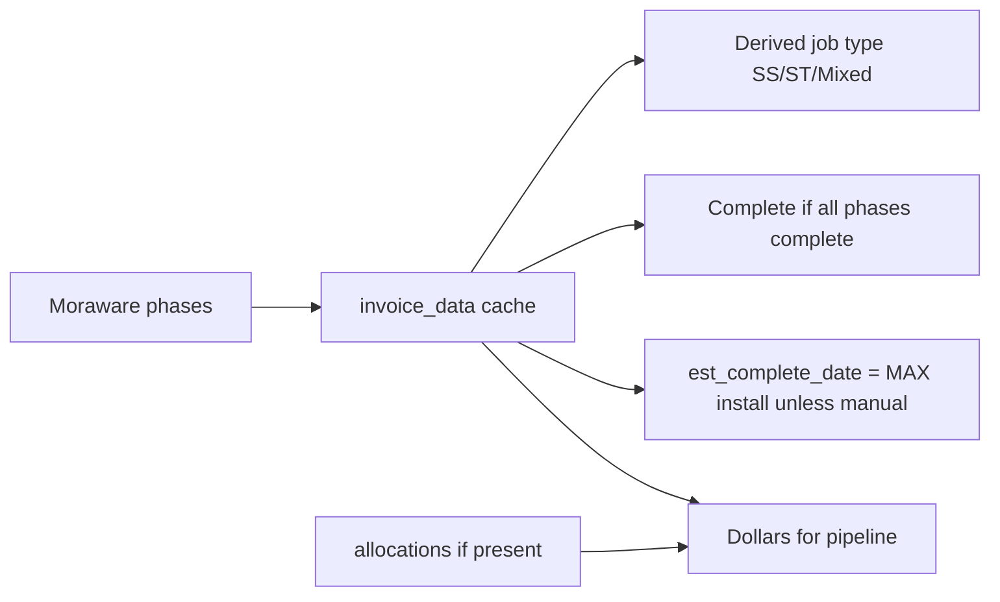

# PM pipeline, history & reports

**Bottom line:** PM forecasting and history consume **cached Moraware phase rows** (`invoice_data`) on WON bids (parents excluded from rollups). Job type is **derived** (SS*/ST* phases or revision SF). Dollars prefer **allocations** when present, else summed invoice TP. Estimator **Reports** is a separate, win-rate–focused surface. Some PM overview/monthly APIs exist in code but are **unwired** in the live PM portal.

> **Framing:** WHAT / WHY is authoritative. CounterPro already caches Moraware — map phases onto existing caches; do not invent a second invoice store. BidTracker UI wiring gaps are called out explicitly.

---

## WHAT / WHY (business rules)

### `invoice_data` phases

Each synced phase row (per bid, optionally scoped by `moraware_job_id`) carries roughly:

- `phase` label (e.g. SS… / ST…)
- `tp_code` (dollars), `sq_ft`
- `template_date`, `install_date`, `invoice_date`
- `invoice_status` (e.g. complete)
- contact notes / source metadata

`upsert_invoice_data` **replaces** all phase rows for a bid with the latest sync payload.

### Derived job type (not stored)

From `get_pm_job_type`:

1. If invoice phases include both `SS%` and `ST%` → **Mixed**
2. Else SS% → **Solid Surface**; ST% → **Stone**
3. Else fall back to latest revision SF (both → Mixed; solid only / stone only)
4. Else **Unassigned**

### Estimated complete date

- On invoice upsert, if `est_complete_date_manual` is **not** set:  
  `est_complete_date = MAX(install_date)` across that bid’s invoice rows.
- Manual flag freezes the date against sync overwrites.
- Used for projected “complete this month” style rollups when phases are not yet complete.

### Estimated start month

- `est_start_month` is a local forecast field for **unscheduled** work (no template date yet).
- Pipeline forecast uses template date for “In Progress” starts, and `est_start_month` for Unscheduled estimated starts.

### Pipeline / backlog states (forecast logic)

For WON + linked + has `moraware_job_status`, excluding rollup parents:

| State | Rule |
|---|---|
| **Complete** | Has phases and **every** phase `invoice_status` is complete |
| **In Progress** | Not complete, but at least one `template_date` |
| **Unscheduled** | Otherwise (no template) |

Dollars / SF for backlog:

- Prefer **sum of allocations** when allocation rows exist for the bid
- Else sum `tp_code` / `sq_ft` from `invoice_data`

Horizon:

- Rolling window (default **90 days**) buckets confirmed vs estimated starts by month
- Starts beyond the window accumulate in a **90+** bucket
- Separate **needs sync** queue: WON bids missing job id or job status

### Completed history

- Monthly revenue + solid/stone SF from **completed** invoice phases (`invoice_status` complete + invoice date present).
- Wired UI: **PM → Completed History** (`PMHistoryTab`).

### Estimator Reports (separate portal)

- Estimator **Reports** tab focuses on bid volume, status mix, **win rate**, customer breakdown, monthly charts, account PDF export.
- It is **not** the PM pipeline forecast. Treat as estimator analytics over `bids` / revisions / statuses.

### Multi-phase note (CounterPro reconciliation)

BidTracker models **per-phase** invoice rows. Some CounterPro / Moraware cache designs historically key or display **first phase only**. When mapping:

- **Reconcile** phase-level totals and dates explicitly.
- Do **not** “round away” secondary phases to make charts look clean — multi-phase jobs are real and affect complete-vs-in-progress and dollars.

---

## Gaps / unwired surfaces (flag)

| Capability | In code? | Wired in PM portal? |
|---|---|---|
| `PMHistoryTab` + `get_pm_completed_history` | Yes | **Yes** (Completed History tab) |
| `get_pm_pipeline_forecast` / overview stats | Yes (`database.py`, `ui/pm_overview_tab.py`) | **No** — `PMOverviewTab` is **not** added in `PMWindow` |
| `get_pm_monthly_report` | Yes | **No** dedicated tab using it in current hub |

Preserve the **business meaning** of pipeline/overview if CounterPro builds equivalent dashboards; do not assume BidTracker’s overview UI is production-complete.

---

## HOW BidTracker does it (reference)

| Concern | Path |
|---|---|
| Phase upsert + auto est complete | `database.py` → `upsert_invoice_data` |
| Job type / notebook status / overview / forecast / monthly / history | `database.py` → `get_pm_job_type`, `get_pm_notebook_status`, `get_pm_overview_stats`, `get_pm_pipeline_forecast`, `get_pm_monthly_report`, `get_pm_completed_history` |
| Completed History UI | `ui/pm_history_tab.py` |
| Unwired overview UI | `ui/pm_overview_tab.py` (exists; not mounted) |
| Estimator reports | `ui/reports_tab.py` |
| Invoice sync callers | `ui/awarded_tab.py`, `ui/pm_active_jobs_tab.py`, sync dialogs |
| Est start month editor | `ui/awarded_tab.py` won-details dialog |

---

## Invariants to preserve in CounterPro

1. Complete job = all phases complete (not “any phase complete”).
2. Dollars: allocations override invoice TP when allocations exist.
3. Job type derived; do not invent a conflicting stored enum without migration plan.
4. Manual est-complete must win over sync.
5. Map multi-phase carefully against CounterPro caches — never drop secondary phases silently.
6. Treat BidTracker PM Overview / monthly report UI as incomplete reference, not a shipped product surface.
